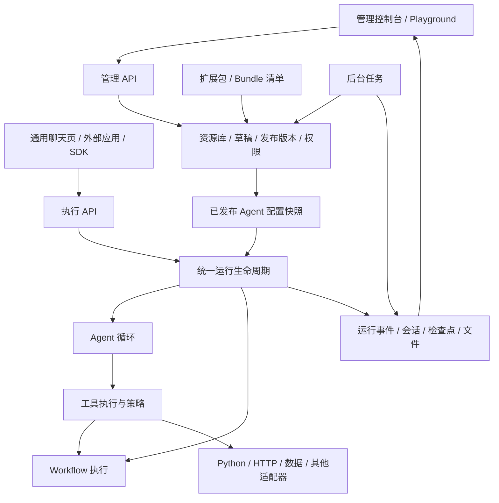

# 公共开源 Agent 框架：架构与实施方案

修改开始日期：2026-09-20。

状态：独立 Eivon 项目的范围与验收基线。文中的目录、接口、实体、页面及版本路线仍是设计参考；当前实现与验证状态以 `docs/DELIVERY.md`、`README.md` 和仓库测试为准。

## 1. 项目目标与交付形态

从 FarmLynk v2 提取公共运行能力，建设一个可独立放到 GitHub、可自托管、带完整 Web 管理后台的 Agent 框架。使用者自行定义业务、工具、技能、工作流、数据源和 Bundle，框架不预设行业、业务身份或 Bundle 数量。

交付包含五部分：

1. 可作为 Python 库使用的 Agent 内核。
2. 提供管理 API、对话 API、流式事件和后台任务的服务端。
3. 管理控制台、调试 Playground 和通用对话页面。
4. 扩展 SDK、脚手架、示例、部署和升级工具。
5. 可验证的测试、版本兼容规则和贡献文档。

基本使用路径：启动服务 → 创建管理员 → 配置模型 → 添加工具/技能 → 创建 Agent → 调试 → 发布 → 网页或 API 调用 → 查看执行记录。

“完整”的含义是上述闭环可用。复杂工作流画布、公开插件市场、托管计费和自动修改生产配置的学习系统属于后续独立能力，不作为首个完整版本的前置条件。

## 2. 当前代码能贡献什么

| 现有模块 | 处理方式 | 新框架中的落点 |
| --- | --- | --- |
| agent_runtime | 提取循环、工具结果处理、Hooks；移除具体会话字段与默认业务包假设 | runtime |
| model_policy | 提取能力、Profile、Provider 契约；统一 Agent、Workflow 和后台任务调用 | models |
| tools/contracts、registry、execution | 提取协议与分发；补统一参数校验、授权、预算和审批入口 | tools |
| skills_and_prompt_assets | 提取技能描述、读取、动作协议和提示词组装；外置技能根目录与领域规则 | skills、prompts |
| bundles | 保留组合思想；移除固定 ID、业务类型映射和 personal 回退 | bundles |
| session_and_transcript | 提取会话、事件、检查点；重设计用户身份和上下文持久化 | sessions、runs |
| workflow | 提取注册和执行协议；清除报告专用处理与具体业务依赖 | workflows |
| knowledge | 提取检索、文档与索引协议；移出品种知识来源，扩展 Provider 工厂 | knowledge |
| shared/artifacts | 提取文件产物协议和格式适配；解除特定存储与农业报告依赖 | artifacts |
| shared/logging、memory/improvement | 复用关联日志与失败反思机制；补持久化运行视图和任务领取 | observability、improvement |
| bootstrap、settings | 从固定农业装配改为依赖声明、配置解析和按需装配 | server/bootstrap |
| interface | 复用流式和交互协议经验；新建通用 API，原兼容接口留在农业项目 | server/api |
| recommendations、variety_retrieval、growth_export、农业 Tools/Skills/Workflows、查询视图 | 保留在农业侧 | FarmLynk 扩展包 |

当前仓库未发现独立管理前端工程；现有主要页面是交互流测试 HTML。管理前端以及多数资源 CRUD、版本发布和权限接口需要新建。

现有 ORM 中出现 prompt_assets、skill_assets 等表定义，不等于已具备资源管理和发布闭环；不能只增加页面就把这些表视为成熟管理能力。

长期跨会话记忆尚不是现成完整能力；现有 memory 主要实现失败采集、反思和改进项生成。知识检索机制较通用，但当前工厂主要装配 DashScope，不能直接宣传任意检索供应商即插即用。

## 3. 总体结构



管理侧负责“谁可以配置什么、哪个版本生效”；运行侧负责“这一轮按哪个版本执行、产生了什么结果”。首版用模块化单体部署，保留同代码库 worker 进程入口，不为每个模块建立微服务。

内核不依赖 FastAPI、前端或农业包；服务端负责认证、数据库、队列、HTTP 和依赖注入。业务扩展只依赖公开 SDK/协议。前端通过公开 API 使用服务端，不直接访问数据库或服务器文件。

## 4. 核心对象与边界

| 对象 | 定义 | 边界 |
| --- | --- | --- |
| Workspace | 一组资源和成员的管理隔离空间 | 自托管默认创建一个；不与任何行业或 Bundle 等同 |
| Principal | 服务端验证的用户或调用方身份 | 包含主体、工作空间和权限；不能由模型参数决定 |
| Agent | 可发布、可调用的智能体配置 | 引用模型、提示词、工具、技能、工作流、知识集合和运行策略 |
| Bundle | 可复用的能力组合清单 | Agent 可以直接绑定资源，也可以引用一个或多个 Bundle；不要求创建 Bundle 才能对话 |
| Extension package | 工具/工作流/适配器实现及资源的交付包 | 和 Bundle 分离；一个实现包可支持多个能力组合 |
| Tool | 具有输入输出契约的可执行能力 | 名称、Schema、实现入口、权限需求、超时、重试与副作用属性 |
| Skill | 方法说明、参考资料与可选动作 | 内容版本和执行动作依赖必须同时可追溯 |
| Workflow | 显式注册的业务流程 | 首版支持代码处理器及标准执行契约；不把任意 Python 自动转换为可视化图 |
| BusinessContext | 当前业务对象与上下文 | 插件声明 Schema，框架验证；没有 farm/field 固定字段 |
| AuthorizationContext | 当前身份允许执行与访问的范围 | 由可信认证与业务授权适配器产生；不能把页面选中的对象当成授权 |
| Session / Run / Event | 对话容器、一次执行、执行中事件 | Session 属于 Workspace 和调用者；Run 固定资源版本；Event 按序记录 |
| Artifact | 文件结果 | 保留来源 Run、生成器、存储位置和访问权限 |

Bundle 使用开放 ID 和版本，不使用四种业务枚举。资源名称采用命名空间；冲突在发布时报告并要求显式消解，不按加载先后隐式改变行为。首版可以禁止 Bundle 循环引用，并对复杂嵌套设发布校验。

未知 Agent、Bundle 或失效版本返回明确错误，不回落为默认农业业务。租户/Workspace 的凭据与数据连接属于部署绑定，不嵌入可分发的 Bundle 内容。

工具、技能和工作流的选择以已授权资源、元数据、检索或模型决策为依据，不在内核引入行业关键词路由树。顶层显式 Workflow 调用和 Agent 内 Workflow 工具调用可以同时存在，并共用 Run 生命周期。

## 5. 配置、代码与发布怎样共同工作

### 5.1 资源生命周期

统一采用：草稿 → 校验 → 调试 → 发布不可变版本 → 绑定到 Agent Release → 运行使用快照。

- 管理后台可编辑 Prompt、Skill 文本/参考资料、连接配置、Agent 和 Bundle 清单。
- Python 工具、代码 Workflow 和适配器通过开发者维护的扩展包部署。控制台展示其 Schema、版本、绑定和状态，不在线改写运行中的 Python 源码。
- HTTP 工具可在页面配置或从受支持的 OpenAPI 子集导入；明确展示无法映射的认证或 Schema，不假装支持全部协议。
- Skill 的脚本动作引用已安装实现或经过验证的执行环境，不能把上传脚本直接等同于允许在主服务执行。
- 文件/Git 导入与页面编辑统一生成资源版本。包内资源的 UI 修改生成显式派生草稿，后续包升级显示差异，不反写已安装包目录。
- 单次 Run 固定 Agent Release、模型配置版本、Prompt/Skill/Bundle/Tool/Workflow 版本及扩展包摘要。
- 发布新版本只影响新的 Run；旧 Run 和 checkpoint 继续引用原快照。删除和卸载前检查仍被使用的版本。

凭据单独存储并通过 credential_ref 绑定，普通资源读取与导出不返回明文。历史执行保留凭据引用及轮换记录，不为“重放”复制旧密钥。资源变更影响分析与版本回滚属于管理后台的正式功能。

### 5.2 一个配置结构示意

以下字段用于说明目标契约，最终以实现 Schema 为准：

```yaml
schema_version: 1
kind: Agent
id: example.assistant
model_profile_ref: default-chat@1
prompt_ref: example.system@1
bundle_refs: []
tool_refs:
  - example.lookup@1
skill_refs:
  - example.answering@1
workflow_refs: []
knowledge_collection_refs: []
context_schema_ref: example.context@1
execution_policy_ref: default@1
```

发布器将引用解析为不可变快照，并检查工具依赖、模型能力、安装版本、权限策略和缺失配置。UI 和 CLI 共享同一发布器，避免各自实现不同规则。

## 6. 管理前端页面规划

导航按“构建、运行、管理”组织；Agent 详情作为日常入口，资源选择、测试和问题定位尽量就近完成。

| 页面 | 主要功能 | 后端前提 | 交付阶段 |
| --- | --- | --- | --- |
| 初始化与登录 | 创建初始管理员、登录、默认 Workspace、基础配置引导 | 身份、成员、初始化状态 | v0.1 |
| 总览 | Agent 数量、运行量、成功率、延迟、Token、近期错误 | Run 聚合，指标口径定义 | v0.1 |
| Agent 列表与详情 | 新建、复制、模型与能力绑定、上下文配置、草稿发布、版本回滚 | Agent 与 Release | v0.1 |
| Playground | 实时对话、选择草稿/已发布版本、查看工具过程、停止、补充输入、反馈 | 与生产相同的 Run 引擎，调试权限 | v0.1 |
| 通用对话页 | Agent 选择、会话历史、流式回答、附件、产物、交互确认 | 执行 API、Session 与 Artifact 权限 | v0.1 |
| 模型与凭据 | Provider、Endpoint、模型能力、连接测试、密钥更新 | 模型适配器、凭据服务 | v0.1 |
| 工具中心 | 已安装工具、Schema、HTTP 工具配置、独立测试、启停与使用位置 | 工具资源版本、测试 Run、运行策略 | v0.1 |
| 技能中心 | Markdown 编辑、元数据、参考文件、依赖工具、校验、版本差异 | Skill 资源库、依赖解析 | v0.1 |
| Prompt 管理 | 模板、变量、预览、版本与使用位置 | Prompt Schema、组装器 | v0.1 |
| Bundle 管理 | 自定义组合、依赖检查、版本、导入导出、被哪些 Agent 引用 | Bundle manifest 与解析器 | v0.1 |
| 工作流中心 | 注册流程列表、输入输出 Schema、配置表单、独立调试、等待与恢复记录 | Workflow 契约和运行事件 | v0.1 |
| 运行记录与详情 | 筛选、事件时间线、模型/工具输入输出摘要、错误、版本、停止状态 | Run、Event、Span、脱敏 | v0.1 |
| 会话与文件 | 历史、checkpoint、下载、保留期和删除 | Session、Artifact、存储清理任务 | v0.1 |
| 成员、API Key、审计 | 角色、授权范围、密钥撤销、配置变更记录 | 服务端权限和审计 | v0.1 |
| 系统设置 | 存储、运行限额、安装版本、就绪状态 | Settings、Health、扩展注册表 | v0.1 |
| 知识库与数据连接 | 文档上传、同步状态、分块预览、检索调试、来源引用、连接测试 | 通用导入任务、检索与连接适配器 | v0.2 |
| 评测中心 | 测试集、批量运行、规则与人工评分、版本对比 | Eval Job、Case、Result | v0.2 |
| 审批与改进中心 | 高风险调用确认、失败反思、建议审核、绑定到新草稿 | Approval、Reflection、发布流程 | v0.2 |
| 扩展与 MCP 连接 | 扩展清单、能力发现、协议连接测试、版本兼容 | 新的扩展安装与 MCP 适配器 | v0.2 |
| 工作流画布 | 为正式节点模型提供可视化编排、校验、调试 | 需另行实现节点与状态机语义 | v0.3 |

首版可将部分功能放入详情页标签，避免为了菜单数量拆出空页面。每页必须有真实后端、加载/空/错误/无权限状态、分页与必要的变更反馈。

Playground 建议采用三栏：左侧选择 Agent/版本/会话，中间对话与交互，右侧展示当前运行的工具、技能加载、耗时、Token 与错误。运行详情保留可观测的动作和结果，不展示或声称提供模型隐藏思维链。

只读时间线展示属于“运行过程查看”；重新执行称为“重跑”，会产生新 Run。涉及写操作的重跑需再次授权，不以“回放”之名重复产生副作用。

## 7. 服务端接口与数据规划

### 7.1 API 分组

下面为建议路径，不是当前已有端点。管理和执行接口共享身份、资源解析和策略服务。

| 分组 | 代表路径 | 职责 |
| --- | --- | --- |
| 身份与空间 | /api/v1/auth/*、/workspaces/*、/members/* | 登录、成员、权限 |
| Agent 管理 | /api/v1/agents、/agents/{id}/releases | 草稿、发布、复制、回滚 |
| 资源管理 | /api/v1/tools、/skills、/prompts、/bundles、/workflows | 资源、版本、校验、依赖与导入导出 |
| 模型与连接 | /api/v1/model-profiles、/credentials、/connections | 连接配置、测试、凭据绑定 |
| 对话执行 | /api/v1/sessions、/runs | 创建会话和执行，提供幂等请求键 |
| 流式事件 | /api/v1/runs/{id}/events | 按 event sequence 订阅/补取事件 |
| 执行控制 | /api/v1/runs/{id}/cancel、/resume | 请求取消、提交交互或审批结果 |
| 观测 | /api/v1/runs/{id}/trace、/metrics、/audit-events | 过程、聚合、审计 |
| 文件与知识 | /api/v1/artifacts、/knowledge-collections、/ingestion-jobs | 文件与知识任务 |
| 评测与改进 | /api/v1/evaluation-jobs、/reflections、/learning-items | 评测和审核 |

统一错误结构至少包含 code、message、request_id 和可安全返回的 details。列表使用明确分页；修改草稿使用版本号或 ETag 防止互相覆盖；耗时任务返回 job_id。

通用 API 不携带 farm_uuid、field_uuid、user_phone 等固定农业字段。已有农业接口和 SSE 历史协议通过 FarmLynk 适配层继续提供。

### 7.2 存储对象

- 管理资源：workspaces、users、memberships、api_keys、credentials、agents、resource_versions、agent_releases、connections、installed_extensions。
- 运行事实：sessions、runs、run_events、run_spans、checkpoints、approvals、artifacts。
- 后台工作：jobs、job_attempts、ingestion_runs、evaluation_cases、evaluation_results、reflections、learning_items。
- 审计：audit_events、资源发布和凭据轮换记录。

实体分成“稳定身份、可编辑草稿、不可变发布版本”；业务内容由各类型 Schema 校验，避免只靠一个任意 JSON 表承担所有契约。所有适用表有 Workspace 归属、索引和保留期；跨表引用与版本唯一性由数据库约束保证。

日志不能替代 Run/Event；Transcript 主要服务对话历史，Run/Event 服务执行观测。允许共享底层事件来源，但必须明确投影、顺序与最终提交规则。

## 8. 运行可靠性与扩展边界

这些能力直接支撑停止按钮、运行列表、发布版本和插件执行，属于平台功能实现，不是额外装饰。

1. 统一状态：queued、running、waiting_input、waiting_approval、cancelling、completed、failed、cancelled；事件带 run_id 和递增 sequence。
2. 取消请求和取消完成分开。模型流、工具、Workflow 逐层传播取消；不可立即停止的外部调用如实显示，不提前标记完成。
3. 同 Session 并发策略显式配置，首版可默认排队或拒绝并行；多进程使用共享协调和租约，不能靠进程内字典保证一致性。
4. 任务领取、心跳、重试和最终状态提交有幂等边界；不同 worker 不重复处理同一反思或索引任务。
5. SSE 断线可按事件序号重连；传输批量与持久化粒度可优化，但不能破坏事件顺序或因重连再次启动任务。
6. ToolExecutor 在实际执行前统一检查输入 Schema、已发布可用能力、Principal 权限、资源授权、预算和审批；目录中隐藏工具不等同于禁止调用。
7. 模型、工具、Skill 动作、Workflow、检索、文件导出都有超时、结果大小及总运行预算。未知用量显示未知，费用只在配置价格并有用量依据时估算。
8. 代码扩展由部署者安装。脚本动作进入独立 runner，限制可用环境变量、工作目录、资源和网络；首版缺少隔离能力的执行方式应禁用或明确限定可信部署模式。
9. HTTP、数据库和文件连接使用服务端策略，防止配置绕过工作空间权限或访问未授权地址；具体业务的行数据授权由领域适配器落实，框架负责强制调用该边界。
10. Improvement 只生成建议和评测候选，不自动更改已发布 Prompt、Skill 或工具权限。

## 9. 技术与部署建议

建议沿用 Python / FastAPI / Pydantic / SQLAlchemy 的后端基础，降低迁移成本。前端候选为 React + TypeScript + Vite + 成熟组件库；团队已有 Vue 标准时可替换，API 与领域协议不依赖前端选型。本方案不锁定具体库版本，实施时验证兼容性并固定依赖。

默认自托管发行提供 Web、API、worker、PostgreSQL、Redis 和本地持久化目录的 Compose 组合。可由同一个服务镜像提供 API 与 worker 两种进程命令。PostgreSQL 保存事实，Redis 用于任务/租约/通知等协调；具体队列实现单独做兼容验证。

业务查询库不是框架启动条件；向量检索作为可选功能启用；默认文件存储使用持久化本地目录，S3 兼容存储以适配器提供。SDK 内核允许内存适配器用于测试和最小示例。

健康检查拆分 liveness 与 readiness，按已启用组件报告；模型未配置时允许进入初始化管理后台。平台可以启动并展示待配置项，不能因缺少某个行业 API 而整体启动失败。

## 10. 建议的新仓库结构

以下是未来独立仓库，不是在当前 FarmLynk 根目录直接增建的实施结果：

```text
agent-framework/
  apps/
    server/                 # FastAPI、管理和执行 API、任务入口、装配
    console/                # 控制台、Playground、通用聊天页
  packages/
    agent_core/             # 无业务依赖的运行协议与内核
    agent_sdk/              # 扩展接口、资源 Schema、脚手架
    agent_adapters/         # 模型、存储、HTTP、可选检索/MCP
    client_sdk/             # 外部调用客户端；可以分阶段交付
  examples/
    minimal_agent/
    custom_tool/
    custom_skill/
    custom_bundle/
    custom_workflow/
  tests/
    contracts/
    integration/
    e2e/
  deploy/
    compose.yaml
    Dockerfile
  migrations/
  docs/
  .github/workflows/
  pyproject.toml
  README.md
  CONTRIBUTING.md
  LICENSE
```

这是代码边界，不要求每个目录都独立发布一个包。首版可减少发行物数量，但必须用依赖检查阻止 core 导入 server、农业实现或开发者私有服务。

## 11. 实施路线与验收

### M0：公共契约与抽取清单

产出：模块迁移矩阵、Agent/Bundle/Tool/Skill/Run Schema、身份与业务上下文协议、API 草案、前端信息架构、依赖方向规则。

验收：两个不同的合成业务示例能够用同一套契约表达；扩展包不依赖 FarmLynk 的实体和租户表。无需为验证创建真实业务系统。

### M1：独立内核与服务基础

产出：新仓库、公共内核、通用会话与模型接入、工具与技能加载、标准事件、认证与 Workspace 骨架、容器启动。拆除农业默认装配，迁移相关确定性测试。

验收：空数据库可初始化；不配置农业库和服务也能运行；SDK 示例完成工具调用；标准执行接口具备身份与资源归属校验。测试使用假模型，不依赖生产服务。

### M2：管理与执行端到端闭环，形成 v0.1

产出：资源草稿/发布/快照、管理 API、表中 v0.1 页面、Playground、通用聊天页、Run 时间线、文件交付、基础权限、安装教程。

实施按纵向切片推进：模型配置 → Agent 创建 → 单次聊天 → 工具注册与调用 → 技能发布 → Bundle 组合 → Workflow 调试 → 运行记录。每个切片同时完成数据、API、UI 与端到端验证。

验收：陌生开发者按文档启动，在 UI 配置模型和能力后发布 Agent，网页与 API 都可调用；新增工具/技能/Bundle 不改内核；发布版本不会改变进行中的 Run。

### M3：能力补齐与正式公开 Beta，形成 v0.2

产出：知识库与连接管理、评测、审批与改进页面、MCP 等扩展适配、后台任务可靠领取、多进程取消与恢复、升级与备份文档、公开 CI。

验收：两套独立 Bundle 可共存；工作空间访问隔离；断线重连不重复执行；worker 重启后状态可追踪；一键恢复到上一 Agent Release；Run 能追溯全部资源版本。

### M4：稳定版与进阶编辑能力

产出：兼容性政策、迁移支持、性能基线、完整用户文档。根据用户反馈加入正式工作流节点模型和画布、更多连接器、更丰富扩展分发方式。

验收：发布/升级/回滚和真实用户上手流程达到稳定标准；新增页面有相应后端语义和测试。稳定版不以菜单数量或抽象数量判断。

FarmLynk 回接可以作为独立兼容项目并行推进：依赖新框架，保留农业资产与旧接口适配。它是验证公共接口的案例，不应成为公共框架支持其他领域的启动依赖，也不要求首版公开农业实现。

## 12. 测试与开源发布检查

测试重点：

- 契约测试：工具、技能、工作流和存储适配器实现同一协议；未授权直接调用必须失败。
- 集成测试：草稿发布、引用解析、版本冻结、会话恢复、工作流等待、文件权限、索引任务。
- 前端 E2E：初始化 → 配置模型 → 添加能力 → 创建发布 Agent → 对话 → 查看工具事件 → 停止/恢复 → 查看文件。
- 并发与故障：不同 worker 请求取消、重复 resume、租约过期、客户端断连、外部服务超时、任务重试不重复副作用。
- 去领域化：公共包不导入农业代码；两个合成领域示例不修改 core；业务库缺席仍能启动。
- 发布验证：新机器从发行文件启动、数据库迁移、备份恢复、版本回退、仅启用必要组件的就绪检查。

新开源仓库按迁移清单提取文件并建立干净发行记录，不直接把现有整个仓库及历史公开。发布资产只包含必要源码、文档、测试和合成示例；检查随附 Skill、字体、图片与其他第三方资产的来源和可分发条件，记录保留项的许可说明。现有部署中的专用镜像仓库和下载地址必须移除或替换为公开可复现的构建输入。

README 至少提供：产品截图、能做什么、快速启动、首个 Agent、扩展工具/技能/Bundle、API、运行观测、部署升级和贡献入口。项目许可证、贡献规则及发布流程在第一次公开发行前明确。

## 13. 工作量与优先级判断

范围已经从“抽内核”扩大为“建设带控制台的自托管产品”。主要新增工作集中在管理资源模型、版本发布、前端、权限和运行可观测性；不能沿用仅抽取内核的工期估计。

在保留现有后端技术、复用界面组件、首版不包含复杂画布及公开插件市场、没有额外业务迁移要求的前提下，可把完整公开 Beta 暂按约 24–40 人周作为规划量级；约 3 名熟悉相关技术的全职开发者通常应预留约 3–4 个月及集成缓冲。这里是任务拆分前的估计，M0 契约和页面规格明确后重新估算；不以代码行数推算完成比例。

第一批应开工的事项：

1. 通用身份、业务上下文与资源授权契约。
2. Agent、Bundle、扩展包三者的职责和版本模型。
3. 管理资源到 Run 配置快照的发布链路。
4. 去农业装配的最小可启动服务。
5. 登录、模型配置、Agent 详情、Playground、运行详情这五个页面的真实闭环。

随后按同一资源协议扩展技能、工具、Prompt、Bundle、Workflow 等管理页。这样新页面有稳定后端基础，运行内核也能持续独立验证。

## 14. 关键源码依据

以下路径均相对于 farmlnyk-agent-v2/，表示本次阅读依据：

- src/farmlnyk_agent_v2/bootstrap/lifespan/builders.py：农业客户端、服务、工具和默认资源的集中装配。
- src/farmlnyk_agent_v2/bundles/contracts/models.py：固定 BundleId 与协议。
- src/farmlnyk_agent_v2/bundles/registry/service.py：具体业务能力组合与默认回退。
- src/farmlnyk_agent_v2/bundles/runtime/models.py：BundleRuntime 与具体数据适配器绑定。
- src/farmlnyk_agent_v2/profiles_and_context/contracts/models.py：农业 ScopeContext。
- src/farmlnyk_agent_v2/session_and_transcript/contracts/models.py：会话身份、范围和检查点。
- src/farmlnyk_agent_v2/tools/contracts/models.py：ToolDefinition、ToolRuntimeAdapter 和执行结果协议。
- src/farmlnyk_agent_v2/tools/execution/service.py：工具分发与错误处理。
- src/farmlnyk_agent_v2/skills_and_prompt_assets/skills/loader.py：仓库内技能根目录和读取方式。
- src/farmlnyk_agent_v2/skills_and_prompt_assets/prompting/service.py：农业上下文与表达规则注入。
- src/farmlnyk_agent_v2/workflow/executor/service.py：personal_survey 与农业报告处理。
- src/farmlnyk_agent_v2/knowledge/factory.py、sources.py：Provider 装配及农业知识来源。
- src/farmlnyk_agent_v2/data_access/repositories/models.py：已有持久化实体和预留资源表。
- src/farmlnyk_agent_v2/interface/http/router.py、agents_dev.py、workflows_dev.py：现有接口面。
- src/farmlnyk_agent_v2/shared/stream_interrupts.py：当前进程内流式中断状态。
- src/farmlnyk_agent_v2/memory/README.md：已实现改进链路与预留记忆能力的区别。
- docs/interactive_stream_test.html：已有交互测试页。
- ../Dockerfile：当前专用镜像、文档运行依赖和打包范围。

已有架构问题台账用于理解现状；其中旧结论若与本次源码不一致，以当前源码为准。本方案不会自动改变农业项目已接受的设计或将其历史问题清单全部纳入本次实施。
